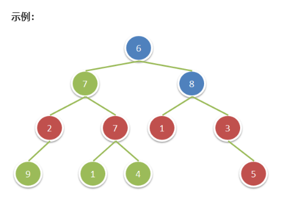
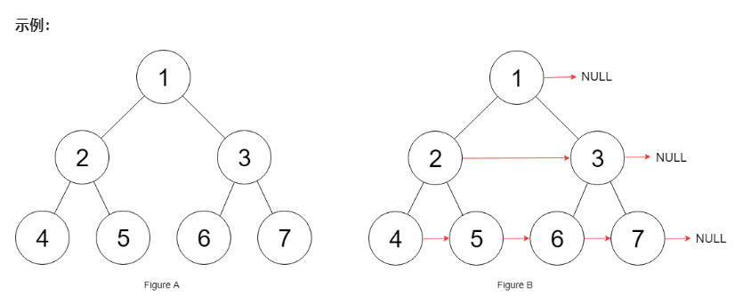
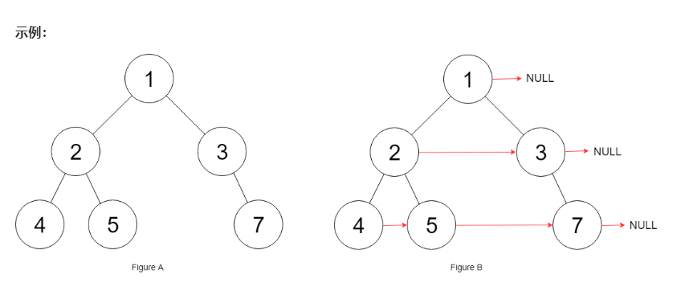

[toc]

### 一. 祖先节点

#### 1.  Leetcode 236. 二叉树的最近公共祖先

##### (1) 题目描述

给定一个二叉树, 找到该树中两个指定节点的最近公共祖先。

百度百科中最近公共祖先的定义为：“对于有根树 T 的两个结点 p、q，最近公共祖先表示为一个结点 x，满足 x 是 p、q 的祖先且 x 的深度尽可能大（一个节点也可以是它自己的祖先）。”

###### a. 递归

```c++
class Solution {
public:
    TreeNode* lowestCommonAncestor(TreeNode* root, TreeNode* p, TreeNode* q) {
        if (root == NULL || root == p || root == q) // 考虑根节点
            return root;
        TreeNode* left = lowestCommonAncestor(root->left, p, q);
        TreeNode* right = lowestCommonAncestor(root->right, p, q);
        if (left == NULL)  // 左子树为空，继续考虑右子树
            return right;
        if (right == NULL) // 右子树为空，继续考虑左子树
            return left;
        if (left != NULL && right != NULL)
            return root;
        
        return NULL;
    }
};
```

#### 2. Leetcode 235 二叉搜索树的最近公共祖先

##### (1) 题目描述

给定一个二叉搜索树, 找到该树中两个指定节点的最近公共祖先。

百度百科中最近公共祖先的定义为：“对于有根树 T 的两个结点 p、q，最近公共祖先表示为一个结点 x，满足 x 是 p、q 的祖先且 x 的深度尽可能大（一个节点也可以是它自己的祖先）。”

###### a. 递归

```c++
class Solution {
public:
    TreeNode* lowestCommonAncestor(TreeNode* root, TreeNode* p, TreeNode* q) {
        int root_val = root->val;
        int p_val = p->val;
        int q_val = q->val;

        if (p_val > root_val && q_val > root_val) return lowestCommonAncestor(root->right, p, q)
        else if (p_val < root_val && q_val < root_val) return lowestCommonAncestor(root->left,  p, q);
        else return root;
    }
};
```

#### 3. Leetcode 1026 节点及其祖先之间的最大差值

##### (1) 题目描述

给定二叉树的根节点 root，找出存在于不同节点 A 和 B 之间的最大值 V，其中 V = |A.val - B.val|，且 A 是 B 的祖先。

（如果 A 的任何子节点之一为 B，或者 A 的任何子节点是 B 的祖先，那么我们认为 A 是 B 的祖先）

###### a. DFS算法

遍历所有的祖先节点对

```
class Solution {
public:
    // 当前节点和祖先节点的最大差值
    int result = 0;
    void dfs(TreeNode* root, int min_val, int max_val) {
        if (root) {
            int dif1 = abs(root->val - min_val);
            int dif2 = abs(root->val - max_val);
            result = max(result, max(dif1, dif2));
            min_val = min(min_val, root->val);
            max_val = max(max_val, root->val);
            dfs(root->left, min_val, max_val);
            dfs(root->right, min_val, max_val);
        }
    }
    int maxAncestorDiff(TreeNode* root) {
        dfs(root, root->val, root->val);
        return result;
    }
};
```


### 二. 父节点

#### 1. 求二叉树中所有节点的父节点

```c++
class Solution {
public: 
    // 首先利用DFS记录二叉树中，所有节点的父节点
    unordered_map<TreeNode*, TreeNode*> hash_map; // 哈希表
    void dfs(TreeNode* root, TreeNode* pre) {
        if (root) {
            hash_map[root] = pre;
            dfs(root->left, root);
            dfs(root->right, root);
        }
    }

    void parent(TreeNode* root) {
    	dfs(root, NULL);
    }
};
```


### 三. 祖父节点

#### 1. Leetcode 1315 祖父节点值为偶数的节点和

##### (1) 题目描述

给你一棵二叉树，请你返回满足以下条件的所有节点的值之和：

* 该节点的祖父节点的值为偶数。（一个节点的祖父节点是指该节点的父节点的父节点。）

* 如果不存在祖父节点值为偶数的节点，那么返回 0



###### a. DFS递归

```c++
class Solution {
public:
    // 添加孙子节点与祖父节点之间的对应关系
    unordered_map<TreeNode*, TreeNode*> grandparents;
    // 前两层节点的祖父节点都为NULL
    void dfs(TreeNode* root, TreeNode* pre, TreeNode* gra_pre) {
        if (root) {
            if (!gra_pre) {
                grandparents[root] = NULL;
                if (!pre) {
                    gra_pre = NULL;
                    pre = root;
                } else {
                    gra_pre = pre;
                    pre = root;
                }
            } else {
                grandparents[root] = gra_pre;
                gra_pre = pre;
                pre = root;
            }
            dfs(root->left, pre, gra_pre);
            dfs(root->right, pre, gra_pre);
        }
    }
    int sumEvenGrandparent(TreeNode* root) {
        dfs(root, NULL, NULL);
        int sum = 0;
        for (auto item = grandparents.begin(); item != grandparents.end(); item++) {
            if (item->second && item->second->val % 2 == 0) 
                sum = sum + item->first->val;
        }
        return sum;
    }
};
```


### 四. 下一个节点

#### 1. 剑指Offer 8 二叉树的下一个节点

##### (1) 题目描述

给定一个二叉树和其中的一个结点，请找出中序遍历顺序的下一个结点并且返回。注意，树中的结点不仅包含左右子结点，同时包含指向父结点的指针。

* 如果节点存在右子树，则下一个节点就是右子树的最左节点
* 如果节点没有右子树，
  * 节点为其父节点的左子节点，则下一个节点是其父节点
  * 节点为其父节点的右子节点，则需要沿着某父节点一直向上遍历，直到某个节点是其父节点的左子节点即可

###### a. 非递归

```c++
TreeNode* nextNode(TreeNode* node) {
	if (!node) return NULL;
    
    // 找到右子树的最左节点
    if (node->right) {
        node = node->right;
        while (node->left) node = node->left;
        return node;
    }
    TreeNode* next = NULL;
    while (node->next) {
        TreeNode* cur = node;
        TreeNode* par = node->next;
        while (par && cur = par->right) {
            cur = par;
            par = cur->next;
        }
        next = par;
    }
    return next;
}
```

#### 2. Leetcode 285 二叉搜索树中的顺序后继

##### (1) 题目描述

给你一个二叉搜索树和其中的某一个结点，请你找出该结点在树中顺序后继的节点。

结点 `p` 的后继是值比 `p.val` 大的结点中键值最小的结点。

###### a. 递归

```c++
class Solution {
public:
    TreeNode* inorderSuccessor(TreeNode* root, TreeNode* p) {
        // 右子树不为空
        //   若右子树的左子树不为空，则返回右子树的最左节点
        //   若右子树的左子树为空，则返回右子树
        if (p->right) {
            p = p->right;
            while (p && p->left) p = p->left;
            return p;
        }
        
        stack<TreeNode*> nodes;
        int inOrder = -9999;
        // 中序遍历: left -> node ->right
        while (!nodes.empty() || root) {
            // 遍历左子树
            while (root) {
                nodes.push(root);
                root = root->left;
            }

            // 处理父节点
            root = nodes.top(); nodes.pop();
            if (inOrder == p->val)
                return root;
            inOrder = root->val;

            // 遍历右子树
            root = root->right;
        }s
        return NULL;
    }
};
```

#### 3. 剑指offer 63 二叉搜索树中的第k个节点

##### (1) 题目描述

给定一棵二叉搜索树，请找出其中的第k小的结点。

例如， （5，3，7，2，4，6，8）中，按结点数值大小顺序第三小结点的值为4。

###### a. 递归

```c++
class Solution {
public: 
	int kthSmallest(TreeNode* root, int k) {
		if (!root) return -9999;
		stack<TreeNode*> nodes;
		int count = 0;
		TreeNode* cur = root;
		while (p && !nodes.empty()) {
			if (p) {
				nodes.push(p);
				p = p->left;
			} else {
				TreeNode* node = stack.top();
				nodes.pop();
				count = count + 1;
				if (count == k)
					return node->val;
				p = node->right;
			}
		}
		return -9999;
	}
}
```


#### 4. Leetcode 116 填充每个节点的下一个右侧节点指针

##### (1) 题目描述

给定一个**完美二叉树(满二叉树)**，其所有叶子节点都在同一层，每个父节点都有两个子节点。二叉树定义如下

```c++
struct Node {
  int val;
  Node *left;
  Node *right;
  Node *next;
}
```

填充它的每个 next 指针，让这个指针指向其下一个右侧节点。如果找不到下一个右侧节点，则将 next 指针设置为 NULL。

初始状态下，所有 next 指针都被设置为 NULL。



###### a. 层次遍历实现

```c++
class Solution {
public:
    void stackOrder(Node* root) {
        queue<Node*> q;
        q.push(root);
        int count = 1;
        while (!q.empty()) {
            while (count > 0) {
                Node* node = q.front();
                q.pop();
                count = count - 1;
                if (count >= 1)
                    node->next = q.front();
                else
                    node->next = NULL;

                if (node->left) 
                    q.push(node->left);
                if (node->right)
                    q.push(node->right);
            }
            count = q.size();
        }
        
    }
    Node* connect(Node* root) {
        if (root == NULL)   
            return root;
        stackOrder(root);
        return root;
    }
};
```

#### 5. Leetcode 117 填充每个节点的下一个右侧节点指针 II

##### (1) 题目描述

给定一个二叉树

```c++
struct Node {
  int val;
  Node *left;
  Node *right;
  Node *next;
}
```

填充它的每个 next 指针，让这个指针指向其下一个右侧节点。如果找不到下一个右侧节点，则将 next 指针设置为 NULL。

初始状态下，所有 next 指针都被设置为 NULL。



###### a. 非递归实现

```c++
class Solution {
public:
    void stackOrder(Node* root) {
        queue<Node*> q;
        q.push(root);
        int count = 1;
        while (!q.empty()) {
            while (count > 0) {
                Node* node = q.front();
                q.pop();
                count = count - 1;
                if (count >= 1)
                    node->next = q.front();
                else
                    node->next = NULL;

                if (node->left) 
                    q.push(node->left);
                if (node->right)
                    q.push(node->right);
            }
            count = q.size();
        }
    }
    Node* connect(Node* root) {
        if (root == NULL)   
            return root;
        stackOrder(root);
        return root;
    }
};
```

a. 不用栈实现

```c++
class Solution {
public:
    Node* pre = NULL;
    Node* leftmost = NULL;
    void processChild(Node* child) {
        if (child) {
            if (!pre) {
                pre = child;
                leftmost = child;
            } else {
                pre->next = child;
                pre = child;
            }
        }
    }
    Node* connect(Node* root) {
        if (root == NULL) return root;
        leftmost = root; // 指向每一层的最左边节点
        Node* cur = leftmost;
        while (leftmost) {
            // 依次遍历每一层
            // 更新时 pre->next = cur; pre = cur;
            pre = NULL; // 指向下一层的节点
            cur = leftmost; // 当前层的节点
            leftmost = NULL; // 指向下一层的第一个节点
            while (cur) {
                processChild(cur->left);
                processChild(cur->right);
                cur = cur->next;
            }
        }
        return root;
    }
};
```

#### 6. Leetcode 199 二叉树的右视图

二叉树的右视图

##### (1) 题目描述

给定一棵二叉树，想象自己站在它的右侧，按照从顶部到底部的顺序，返回从右侧所能看到的节点值。

###### a. 深度优先搜索DFS

从最右边开始遍历

```c++
class Solution {
public:
	vector<int> rightSideView(TreeNode* root) {
		unordered_map<int, int> rightmostValueAtDepth;// 最右边节点的值
		int max_depth = -1;
		stack<TreeNode*> nodes;
		stack<int> depths;
		nodes.push(root);
		depths.push(0);
		while (!nodes.empty()) {
			TreeNode* node = nodes.top(); nodes.pop();
			int depth = depths.top(); depths.pop();
			if (node) {
				max_depth = max(max_depth, depth);
				// 若不存在对应深度的节点
				if (rightmostValueAtDepth.find(depth) == rightmostValueAtDepth.end())
					rightmostValueAtDepth[depth] = node->val;
				if (node->left) {
					nodes.push(node->left);
					depths.push(depth+1);
				}
				if (node->right) {
                    nodes.push(node->right);
                    depths.push(depth+1);
                }
			}
		}
        vector<int> rightView;
        for (int depth = 0; depth <= max_depth; depth++) {
            rightView.push_back(rightmostValueAtDepth[depth]);
        }
        return rightView;
    }
};
```

###### b. 广度优先搜索BFS

对二叉树进行层次遍历，则对于每层节点，最右边的节点一定在最后才被遍历

```c++
class Solution {
public:
	vector<int> rightSideView(TreeNode* root) {
		unordered_map<int, int> rightSideViewAtDepth; // 哈希表
		int max_depth = -1;
		
		queue<TreeNode*> nodes;
		queue<int> depths;
		nodes.push(root);
		depths.push(0);
		while (!nodes.empty()) {
			TreeNode* node = nodes.front(); nodes.pop();
			int depth = depths.front(); depths.pop();
			if (node) {
				max_depth = max(max_depth, depth);
				// 每次访问到节点时可以改变每一层中最后访问的节点
				rightmostValueAtDepth[depth] = node->val;
				
				nodes.push(node->left);
				nodes.push(nodes->right);
				depths.push(depth+1);
				depths.push(depth+1);
			}
		}
		vector<int> rightView;
		for (int depth = 0; depth <= max_depth; i++) 
			rightview.push_back(rightmostValueAtDepth[depth]);
		return rightView;
	}
};
```

