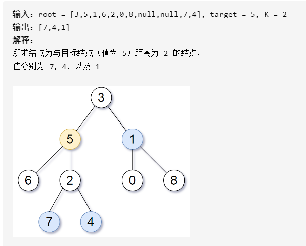

[toc]

###一. 任意两节点的距离

#### 1.  Leetcode 543 二叉树的直径

##### (1) 题目描述

给定一棵二叉树，你需要计算它的直径长度。一棵二叉树的直径长度是任意两个结点路径长度中的最大值。这条路径可能穿过也可能不穿过根结点。

###### a. 递归

```c++
class Solution {
public:
    int max_len = 1;
    int depth(TreeNode* root) {
        if (!root) return 0;
        int L = depth(root->left);
        int R = depth(root->right);
        max_len = max(max_len, L + R + 1);
        return max(L, R) + 1;
    }
    int diameterOfBinaryTree(TreeNode* root) {
        depth(root);
        return max_len - 1;
    }
};
```

#### 2. Leetcode 863 二叉树中所有距离为 K 的结点

##### (1) 题目描述

给定一个二叉树（具有根结点 root）， 一个目标结点 target ，和一个整数值 K 。

返回到目标结点 target 距离为 K 的所有结点的值的列表。 答案可以以任何顺序返回。



##### (2) 求解过程

这道题可分两步来考虑，

* 首先考虑根节点到树中某个节点的距离
* 考虑如何求树中任意节点之间的距离
* 判断两个节点的距离是否为指定值

###### a. 到根节点的距离为target的所有节点值

```c++
class Solution {
public:
    vector<int> nodes;
    void searchNode(TreeNode* root, int target) {
        if (root) {
            if (target == 0) {
                nodes.push_back(root->val);
                return;
            }
            target = target - 1;
            searchNode(root->left, target);
            searchNode(root->right, target);
        }
    }
}
```

###### b. 到二叉树中任意节点node距离为target的所有节点值


### 二. 叶子节点之间的距离

#### 1. Leetcode 1530 好叶子节点对的数量

给你二叉树的根节点 root 和一个整数 distance 。

如果二叉树中两个 叶 节点之间的 最短路径长度 小于或者等于 distance ，那它们就可以构成一组 好叶子节点对 。

返回树中 好叶子节点对的数量 。
