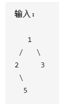

[toc]

### 一. 从根节点到叶子节点的路径

#### 1. Leetcode 112 (路径总和 I)

`限制条件: 从根节点到叶子节点`

##### (1) 题目描述

给定一个二叉树和一个目标和，判断该树中是否存在**根节点到叶子节点**的路径，这条路径上所有节点值相加等于目标和。

示例: 给定下列二叉树，sum = 22，判断是否存在某个叶子节点，使得根节点到叶子节点的路径为22


###### a. 递归

从根节点出发，遍历一个节点，则改变sum的值

```c++
/**
 * Definition for a binary tree node.
 * struct TreeNode {
 *     int val;
 *     TreeNode *left;
 *     TreeNode *right;
 *     TreeNode(int x) : val(x), left(NULL), right(NULL) {}
 * };
 */
class Solution {
public:
    bool hasPathSum(TreeNode* root, int sum) {
        // 先序遍历
        if (root == NULL) return false;
        sum = sum - root->val;
        if (sum == 0 && !root->left && !root->right) return true;
        return hasPathSum(root->left, sum) || hasPathSum(root->right, sum);
    }
};
```

###### b. 非递归

层次遍历的思想，用队列记录到某个值时，sum的值与当前值相减，若此时恰好等于0，则返回true

```c++
/**
 * Definition for a binary tree node.
 * struct TreeNode {
 *     int val;
 *     TreeNode *left;
 *     TreeNode *right;
 *     TreeNode(int x) : val(x), left(NULL), right(NULL) {}
 * };
 */
class Solution {
public:
    bool hasPathSum(TreeNode* root, int sum) {
        // 根节点为空
        if (root == NULL)
            return false;
        // 根节点为叶子节点
        if (!root->left && !root->right) {
            if (root->val == sum)
                return true;
            else
                return false;
        }
        queue<TreeNode*> q;
        root->val = sum - root->val;
        q.push(root);
        int count = 1;
        while (!q.empty()) {
            while (count > 0) {
                TreeNode* node = q.front();
                int node_sum = node->val;
                q.pop();

                if (node->left) {
                    TreeNode* left = node->left;
                    left->val = node_sum - left->val;
                    // 叶子节点
                    if (!left->left && !left->right && left->val == 0)
                        return true;
                    else 
                        q.push(left);
                }
                if (node->right) {
                    TreeNode* right = node->right;
                    right->val = node_sum - right->val;
                    // 叶子节点
                    if (!right->left && !right->right && right->val == 0)
                        return true;
                    else 
                        q.push(right);
                }
                count = count - 1;
            }
            count = q.size();
        }
        return false;
    }
};
```

#### 2. Leetcode 113 (路径总和II)

`限制条件: 从根节点到叶子节点`

##### (1) 题目描述

给定一个二叉树和一个目标和，找到所有从根节点到叶子节点路径总和等于给定目标和的路径。

**说明: 叶子节点是指没有子节点的节点**

给定下列二叉树，以及目标和`sum=22`，要求找出从根节点到叶子节点中所有和为22的路径


###### a. 递归实现

```c++
/**
 * Definition for a binary tree node.
 * struct TreeNode {
 *     int val;
 *     TreeNode *left;
 *     TreeNode *right;
 *     TreeNode(int x) : val(x), left(NULL), right(NULL) {}
 * };
 */
class Solution {
public:
    vector<vector<int>> results;
    vector<int> path;

    // DFS: 先处理根节点
    void dfs(TreeNode* root, int sum) {
        if (root == NULL) return;
        path.push_back(root->val);
        sum = sum - root->val;

        // 在叶子节点添加路径
        if (!root->left && !root->right) {
            if (sum == 0)
                results.push_back(path);
            // 不遍历到空节点中
            path.pop_back();
            return;
        }
        dfs(root->left, sum);
        dfs(root->right, sum);
        path.pop_back();
    }
    vector<vector<int>> pathSum(TreeNode* root, int sum) {
        if (root)
            dfs(root, sum);
        return results;
    }
};
```

#### 3. Leetcode 437 (路径总和 III) 

`限制条件: 从父节点到子节点`

##### (1) 题目描述

给定一个二叉树，它的每个结点都存放着一个整数值。找出路径和等于给定数值的路径总数。

**路径不需要从根节点开始，也不需要在叶子节点结束，但是路径方向必须是向下的（只能从父节点到子节点）。**


###### a. 递归

依次遍历二叉树的所有节点，并判断某个节点是否能够到达一个子节点，使路径和为sum

```c++
/**
 * Definition for a binary tree node.
 * struct TreeNode {
 *     int val;
 *     TreeNode *left;
 *     TreeNode *right;
 *     TreeNode() : val(0), left(nullptr), right(nullptr) {}
 *     TreeNode(int x) : val(x), left(nullptr), right(nullptr) {}
 *     TreeNode(int x, TreeNode *left, TreeNode *right) : val(x), left(left), right(right) {}
 * };
 */
class Solution {
public:
    int count = 0;
    void hasPathSum(TreeNode* root, int sum) {
        // 先序遍历
        if (root == NULL) return;
        sum = sum - root->val;
        // 注意sum == 0时不能return，有可能后续子节点的和刚好为0，则可多出一条路径
        if (sum == 0) count = count + 1;
        hasPathSum(root->left, sum);
        hasPathSum(root->right, sum);
    }
    void preOrder(TreeNode* root, int sum) {
        if (root != NULL) {
            hasPathSum(root, sum);
            preOrder(root->left, sum);
            preOrder(root->right, sum);
        }
    }
    int pathSum(TreeNode* root, int sum) {
        if (root == NULL)
            return 0;
        preOrder(root, sum);
        return count;
    }
};
```

#### 4. Leetcode 666 路径总和 IV


#### 5. Leetcode 257 二叉树的所有路径

##### (1) 题目描述

给定一个二叉树，返回所有从根节点到叶子节点的路径。

**说明:** 叶子节点是指没有子节点的节点。



本题也可以利用非递归实现，非递归实现过程笔者习惯用递归，因为这样可以保证二叉树层次遍历的顺序。

###### a. 递归

```
/**
 * Definition for a binary tree node.
 * struct TreeNode {
 *     int val;
 *     TreeNode *left;
 *     TreeNode *right;
 *     TreeNode(int x) : val(x), left(NULL), right(NULL) {}
 * };
 */
class Solution {
public:
    vector<vector<int>> paths;
    vector<int> temp;
    void dfs(TreeNode* root) {
        if (root != NULL) {
            // 叶子节点
            // 不会参与后续，递归左右子树，因此需要提前弹出节点
            if (!root->left && !root->right) {
                temp.push_back(root->val);
                paths.push_back(temp);
                temp.pop_back();
                return;
            } else {
                temp.push_back(root->val);
            }
            dfs(root->left);
            dfs(root->right);
            temp.pop_back();
        }
    }
    vector<vector<int>> binaryTreePaths(TreeNode* root) {
        if (root) dfs(root);
        return paths;
    }
};
```

